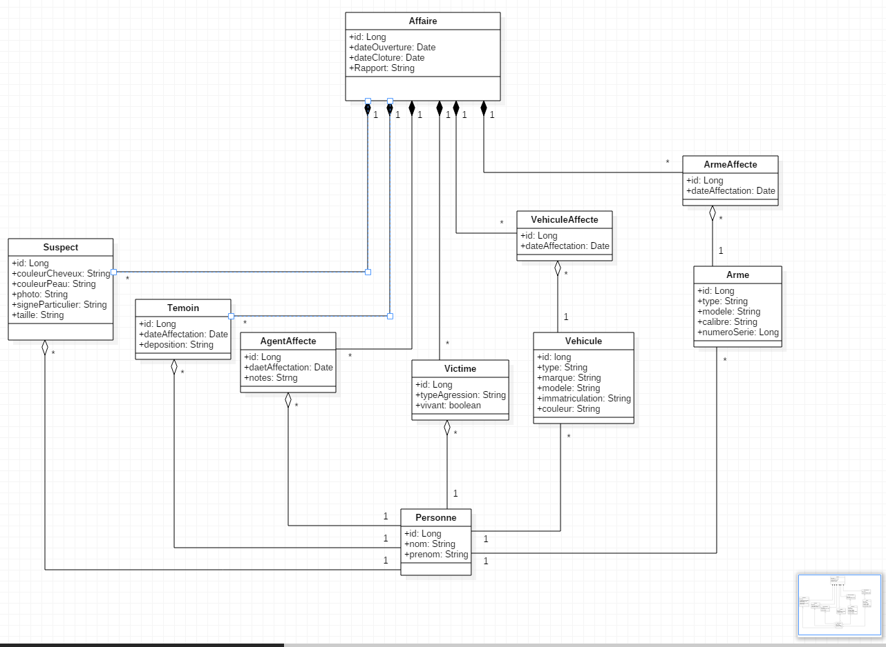

# PROJET FIL ROUGE

## Maquetter une application

### Faire un diagramme USE CASE
  
		
### Faire un diagramme d'activité
[authentification](UML/diagrammeActivite_autentification.pdf)  
[creation Arme](UML/diagrammeActivite_creationArme.pdf)  
[creation Protagoniste](UML/diagrammeActivite_creationProtagoniste.pdf)  
[creation Vehicule](UML/diagrammeActivite_creationVehicule.pdf)  
[gérer les accès](UML/diagrammeActivite_gestionAcces.pdf)  
[rechercher une arme](UML/diagrammeActivite_rechercheArme.pdf)  
[rechercher un véhicule](UML/diagrammeActivite_rechercheVehicule.pdf)  

### Faire un diagramme des classes

        
        
### Identifier les acteurs d'un SI
Dans cette application, les acteurs sont :  
Le chef de service  
Un agent affecté à une affaire
Un agent  
Le personnel judiciaire

        
### Dessiner des wireframe ou mockup (écrans)
[Mockups](UML/mockUp.bmpr)
Le lien amène à un fichier à télécharger en cliquant sur View Raw. Le fichier mockUp.bmpr s'ouvre avec le logiciel Balsamiq  
[télécharger Balsamiq](https://balsamiq.com/)
        
### Modéliser l'enchainement des écrans
L'enchainement des écrans peut se faire dans le mockUp en suivant la procédure :  
Lancer balsamiq  
Ouvrir le fichier précédemment téléchargé  
Lancer le mode plein écran ou taper CTRL+F
        
        
## Concevoir une base de données

### Epliquer le terme SGBDR
Système de Gestion de Base de Données Relationnelle  
Stocke les données de manière organisée et cohérente
        
        
### Utiliser un outil graphique pour créer une base de données
Pour générer la base de données nous avons utilisé le logiciel [MySQLWorkBench](https://www.mysql.com/fr/products/workbench/)
        
        
### Créer/Modifier une table avec ses champs
### Matérialiser une relation entre tables
### Je sais écrire une requête de création de table        
### Je sais définir une clé primaire sur une table
	CREATE TABLE IF NOT EXISTS `gedesaft`.`affaires` (  
  	`id` INT(11) NOT NULL AUTO_INCREMENT,  
  	`dossier` VARCHAR(45) NULL DEFAULT NULL,  
  	`lieu` VARCHAR(45) NULL DEFAULT NULL,  
  	`dateOuverture` DATE NULL DEFAULT NULL,  
  	PRIMARY KEY (`id`),  
  	UNIQUE INDEX `id_UNIQUE` (`id` ASC));  

        
### Je sais définir une clé étrangère sur une table        
### Je sais définir une contrainte sur une colonne donnée
	CREATE TABLE IF NOT EXISTS `gedesaft`.`agentaffecte` (
  	`id` INT(11) NOT NULL AUTO_INCREMENT,
  	`dateAffectation` VARCHAR(45) NULL DEFAULT NULL,
  	`affaires_id` INT(11) NOT NULL,
  	`agents_id` INT(11) NOT NULL,
  	PRIMARY KEY (`id`),
  	UNIQUE INDEX `id_UNIQUE` (`id` ASC),
  	INDEX `fk_AgentAffecte_affaires1_idx` (`affaires_id` ASC),
  	INDEX `fk_AgentAffecte_agents1_idx` (`agents_id` ASC),
  	CONSTRAINT `fk_AgentAffecte_affaires1`
    	FOREIGN KEY (`affaires_id`)
    	REFERENCES `gedesaft`.`affaires` (`id`)
    	ON DELETE NO ACTION
    	ON UPDATE NO ACTION,
  	CONSTRAINT `fk_AgentAffecte_agents1`
    	FOREIGN KEY (`agents_id`)
    	REFERENCES `gedesaft`.`agents` (`id`)
    	ON DELETE NO ACTION
    	ON UPDATE NO ACTION);  

        
## Mettre en place une base de données

### Installer un SGBDR
Lancer MySQL Workbench.  
Ouvrir le fichier [gedesaft2BIS.mwb](BDD/gedesaft2BIS.mwb) 

	File -> Export -> Forward Engineer SQL CREATE SCRIPT ->  
	Choisir le dossier où sauvegarder le ficher SQL -> Next -> Next -> Finish  
	
Ouvrir Workbench  

	File -> RunSQL Script -> Récupérer le fichier SQL généré -> Run  

        
        
### Créer des rôles et une base
        
        
### Exécuter un script de création de tables / données (fichier.sql)
	CREATE TABLE IF NOT EXISTS `gedesaft`.`affaires` (  
  	`id` INT(11) NOT NULL AUTO_INCREMENT,  
  	`dossier` VARCHAR(45) NULL DEFAULT NULL,  
  	`lieu` VARCHAR(45) NULL DEFAULT NULL,  
  	`dateOuverture` DATE NULL DEFAULT NULL,  
  	PRIMARY KEY (`id`),  
  	UNIQUE INDEX `id_UNIQUE` (`id` ASC));  
        
### Ecrire une requête pour insérer des données dans une table
	insert into gedesaft.affaires (id, dossier, lieu, dateOuverture)  
	values (1, 'Theodora', 'Siemkowice', '2017-06-11');
	insert into gedesaft.affaires (id, dossier, lieu, dateOuverture)  
	values (2, 'Filip', 'Srono', '2018-02-13');
	insert into gedesaft.affaires (id, dossier, lieu, dateOuverture)  
	values (3, 'Kessia', 'Hidalgo', '2017-08-28');
	insert into gedesaft.affaires (id, dossier, lieu, dateOuverture)  
	values (4, 'Birgitta', 'Santa Rosa', '2017-09-23');
	insert into gedesaft.affaires (id, dossier, lieu, dateOuverture)  
	values (5, 'Chiarra', 'Rungis', '2017-06-13');
	insert into gedesaft.affaires (id, dossier, lieu, dateOuverture)  
	values (6, 'Barbe', 'Merrifield', '2017-11-27');
	insert into gedesaft.affaires (id, dossier, lieu, dateOuverture)  
	values (7, 'Valry', 'Glempang Tengah', '2017-05-26');
	insert into gedesaft.affaires (id, dossier, lieu, dateOuverture)  
	values (8, 'Krissy', 'Jiaoxie', '2017-08-28');
        
        
### Exporter une structure de tables (données comprises) et la réintégrer dans une autre base de données
Depuis Workbench :  

	Faire un clic droit sur une table et sélectionner 'Table Data Export Wizard'
	Suivre les consignes de la fenêtre qui s'ouvre pour exporter la table et ses données
	Faire un clic droit sur une base de données et sélectionner 'Table Data Import Wizard'
	Suivre les consignes de la fenêtre qui s'ouvre  
	sélectionner le fichier .sql correspondant pour l'importer dans la base.
        
        
    
### Faire un test unitaire manuel  
Exemple d'un test crée pour tester la méthose getVehiculeDetail grâce à la librairie Mockito :  

	package filrouge.gedesaft;  
	import org.junit.Test;  
	import org.junit.runner.RunWith;  
	import org.mockito.Mockito;  
	import org.skyscreamer.jsonassert.JSONAssert;  
	import org.springframework.beans.factory.annotation.Autowired;  
	import org.springframework.boot.test.autoconfigure.web.servlet.WebMvcTest;  
	import org.springframework.boot.test.mock.mockito.MockBean;  
	import org.springframework.http.MediaType;  
	import org.springframework.test.context.junit4.SpringRunner;  
	import org.springframework.test.web.servlet.MockMvc;  
	import org.springframework.test.web.servlet.MvcResult;  
	import org.springframework.test.web.servlet.RequestBuilder;  
	import org.springframework.test.web.servlet.request.MockMvcRequestBuilders;  
  	  
	import filrouge.gedesaft.controller.VehiculeController;	  
	import filrouge.gedesaft.dao.JdbcVehiculeDAO;  
	import filrouge.gedesaft.model.Vehicule;  
	import filrouge.gedesaft.service.VehiculeService;  
  
	@RunWith(SpringRunner.class)  
	@WebMvcTest(value=VehiculeController.class, secure=false)  
	public class VehiculeControllerTest {  
  
	@Autowired  
	private MockMvc mockMvc;  
	  
	@MockBean  
	private VehiculeService vehiculeService;  
	  
	@MockBean  
	private JdbcVehiculeDAO dataDaoImpl;  
	  
	@Test  
    public void getVehiculeDetail() throws Exception {  
			  
		Vehicule vehicule = new Vehicule();  
		vehicule.setId((long) 1);  
		vehicule.setType("camion");  
	  
		Mockito.when(vehiculeService.getVehiculeDetail((long) 1)).thenReturn(vehicule);  
			  
		RequestBuilder requestBuilder =   MockMvcRequestBuilders.get("http://localhost:8080/vehicule/1")  
		.accept(MediaType.APPLICATION_JSON);  
			  
		MvcResult result = mockMvc.perform(requestBuilder).andReturn();  
		         
        System.out.println(result.getResponse());  
        String expected = "{id_vehicule:1, type:camion}";  
	          
        JSONAssert.assertEquals(expected, result.getResponse().getContentAsString(), false);  
	}  
	}    
        
### Coder avec un langage orienté objet  
TypeScript étant un langage orienté objet, nous avons défini toutes nos classes dans le fichier model.ts :  
	
		export class Affaire {  
  
	    public id?: number; // id auto généré  
	    dateOuverture: Date;  
	    dossier: string;  
	    lieu: string;  
	    vehiculesImpliques?: VehiculeImplique[];  
	    armesImpliquees?: ArmeImpliquee[];  
	    suspectsImpliques?: SuspectImplique[];  
	    temoinsImpliques?: TemoinImplique[];  
	    agentsImpliques?: AgentImplique[];  
	}  
  
	export class Personne {  
  
	    public id?: number;  
	    nom: string;  
	    prenom: string;  
	    dateNaissance: Date;  
	}  
  
	export class Suspect extends Personne {  
  
	    public id?: number;  
	    signeParticulier: string;  
	    couleurPeau: string;  
	    couleurCheveux: string;  
	    taille: string;  
	}  
  
	export class SuspectImplique {  
  
	    public id?: number;  
	    suspect: Suspect;  
	    dateImplication: Date;  
	}  
  
	export class Temoin extends Personne {  
  
	    public id?: number;  
	}  
  
	export class TemoinImplique {  
  
	    public id?: number;  
	    temoin: Temoin;  
	    dateImplication: Date;  
	    deposition: string;  
	}  
  
	export class Agent extends Personne {  
  
	    public id?: number;  
	    grade: string;  
	}  
  
	export class AgentImplique {  
  
	    public id?: number;  
	    agent: Agent;  
	    dateImplication: Date;  
	}  
  
	export class Victime extends Personne {  
  
	    public id?: number;  
	    vivant: boolean;  
	}  
  
	export class VictimeImplique {  
  
	    public id?: number;  
	    victime: Victime;  
	    dateAgression: Date;  
	    typeAgression: string;  
	}  
  
	export class Vehicule {  
  
	    public id?: number;  
	    type: string;  
	    modele: string;  
	    couleur: string;  
	    marque: string;  
	    immatriculation: string;  
	}  
  
	export class VehiculeImplique {  
  
	    public id?: number;  
	    vehicule: Vehicule;  
	    dateImplication: Date;  
	}  
  
	export class Arme {  
  
	    public id?: number;  
	    type: string;  
	    modele: string;  
	    calibre: string;  
	    numeroSerie: string;  
	}  
  
	export class ArmeImpliquee {  
  
	    public id?: number;  
	    arme: Arme;  
	    dateImplication: Date;  
	}  
  
        
### Connaître la programmation événementielle 
Exemple de programmation évènementielle utilisée dans notre projet :  
Appel à la fonction afficherId dans le code HTML,  

	<button (click)="afficherId(element.id)" mat-button color="primary" >Détail</button>  

Cette fonction se trouve dans le fichier .ts associé.  

	afficherId(id) {  
	this.router.navigate(['detail', id], {relativeTo: this.route});  
	}  
	    
### Utiliser un Environnement de Développement intégré (IDE)  
Pour rappel, nous avons utilisé VSC pour le front-end, Eclipse Oxygen pour le back-end. 
        
### Versionner mon travail  
Pour versionner notre travail nous avons utilisé GitBash et GitHub.
        
### Mettre des commentaires dans mes programmes 
### Coder selon les règles de l'art 
Se référer au code dans les différents fichiers
        
### Produire un livrable 
Pour produire un livrable, suivre les instructions ci-dessous

# GEDESAFT

Afin de pourvoir installer et lancer l'application, il faut savoir utiliser les lignes de commandes
https://windows.developpez.com/cours/ligne-commande/

## CONFIGURATION REQUISE

- JRE installer sur l'ordinateur (v 1.8), attention la v 1.9 est déconseillée
https://www.java.com/fr/download/help/download_options.xml
- MySql-server (v 5.7 +)
https://dev.mysql.com/downloads/mysql/#downloads
https://openclassrooms.com/courses/administrez-vos-bases-de-donnees-avec-mysql/installation-de-mysql (tuto installation)
- git (v2.14 +) 
https://git-scm.com/book/fr/v1/D%C3%A9marrage-rapide-Installation-de-Git
- Node.js 
https://openclassrooms.com/courses/des-applications-ultra-rapides-avec-node-js/installer-node-js (tuto installation)
https://nodejs.org/en/download/ (téléchargement)
- Angular CLI (v1.6.5 +)
lancer la ligne de commande "npm install @angular/cli" (nécéssite node.js)

## IMPORT DU PROJET

Installer les prérequis si nécéssaire
Télécharger le dossier .zip du projet 
ou l'importer (voir ci dessous)
 - Lancer le gitBash à l'emplacement ou vous voulez importez le projet (click Droit "Git Bash Here")
 - Lancer la commande "git clone https://github.com/DethierY/GEDESAFT.git"
 
## CONFIGURATION TECHNIQUE

Allez dans le dossier **resources** (GEDESAFT\src\main\resources) : 

Dedans se trouve fichier **application.properties**, il faut indiquer les informations de connection a votre base de données (url, et identiffiants admins) 

Lancer le server sql, 
importer la base de données (avec le fichier [gedesaft.sql](BDD/gedesaft.sql) présent dans le dossier BDD,  
importer les données (avec le fichier [data.sql](BDD/data.sql) présent dans le dossier BDD également.

## LANCEMENT DE L'APPLICATION

L'application étant séparée en deux parties, il faut les démarrer toutes les deux pour que l'application fonctionne

### Lancer l'application Springboot
Cloner ou télécharger le dossier back-end https://github.com/DethierY/GEDESAFT.git
  
    Créer un .jar et le lancer: 
    
      Ouvrez une invite de commande dans le dossier "GEDESAFT" et lancez les lignes suivantes :
      
      - mvn package
      - cd target
      - java -jar LesExperts-0.0.1-SNAPSHOT.jar"
	  
### Lancer l'application Angular
Ce projet a été généré avec Angular CLI 1.6.5
Cloner ou télécharger le dossier front-end https://github.com/DethierY/FilRougeV2Front.git

Dans le dossier du front, lancer une ligne de commande
 - npm install
 - ng serve
 
- Dans un navigateur internet, inscrire l'adresse http://localhost:4200/

# REMERCIEMENTS
Nous tenons à remercier les collègues pour leur aide, les professeurs pour leur soutien et Simplon pour leur patience!
